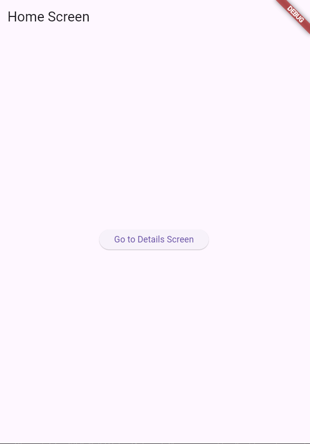
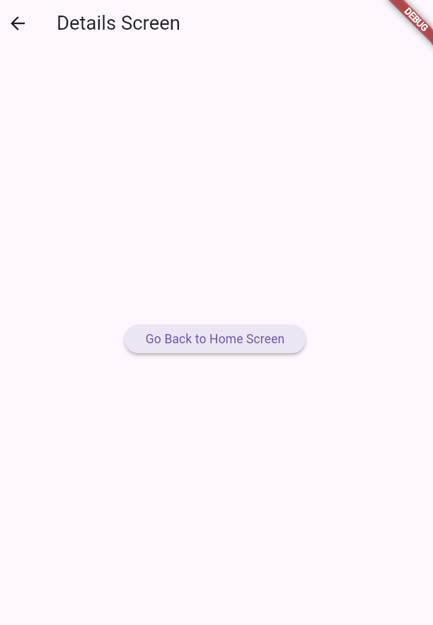
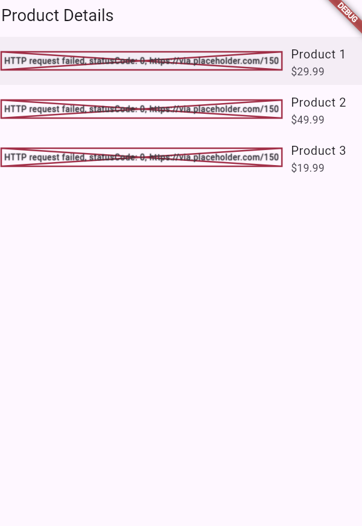
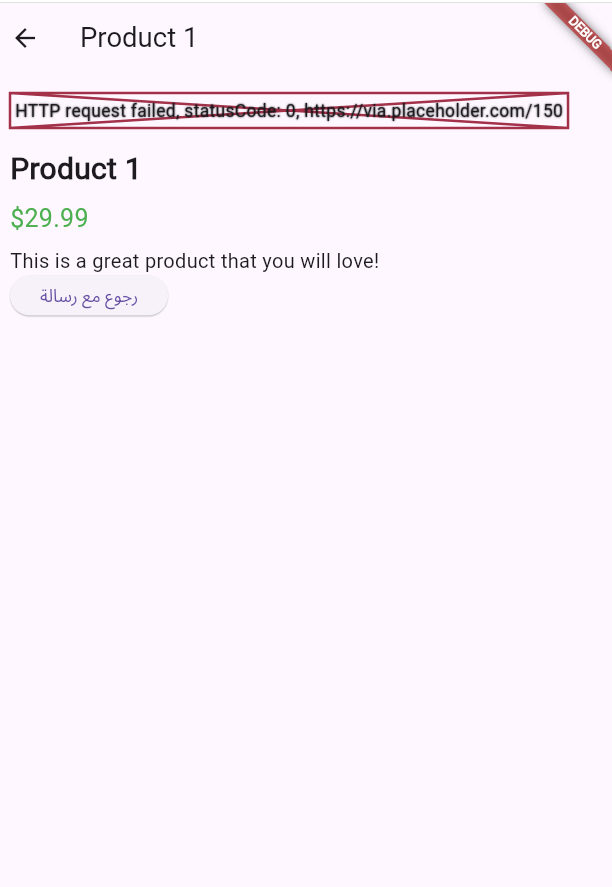
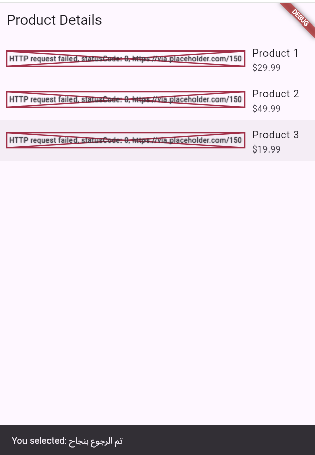

# Navigation & Data Passing App

## 👤 معلومات الطالب

* الاسم: محمد صلاح العواضي
* القسم: (اكتب قسمك هنا)

---

## 📱 وصف التطبيق

هذا التطبيق يوضح:

* التنقل بين الشاشات باستخدام Navigator
* تمرير البيانات بين الشاشات
* إرجاع البيانات وعرضها باستخدام SnackBar

---

## 🧪 التمرين الأول: Navigation

* الانتقال من الشاشة الرئيسية إلى شاشة التفاصيل
* الرجوع باستخدام pop

---

## 🧪 التمرين الثاني: Passing Data

* عرض قائمة منتجات
* تمرير بيانات المنتج عند الضغط
* عرض التفاصيل
* الرجوع مع رسالة

---

## 📸 Screenshots

### 🟢 Home Screen

### 🔵 Detail Screen

### 🟡 Product List

### 🔴 Product Detail

### 🟣 SnackBar Message

---

## [🔗 GitHub Link](https://github.com/m-salah-dev/navigation_app.git)

(يتم وضع الرابط هنا)
